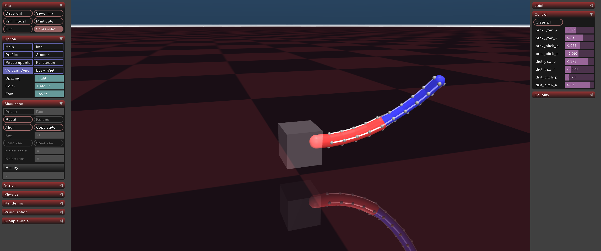

# Project Elephant Trunk



A MuJoCo simulation of a 10-segment (2-stage) hyper-redundant continuum robot, reoriented horizontally for cantilever beam performance testing.

## Features
- **Horizontal Orientation**: Optimized for gravity compensation and cantilever stability testing.
- **2-Segment Architecture**: 5 proximal and 5 distal vertebrae, driven by 8 tendons.
- **Virtual Joystick**: Real-time keyboard navigation with coupling compensation.
- **Physical Tuning**: High-stiffness joints and optimized density for realistic behavior.

## Controls (Virtual Joystick)

| Key | Action |
|-----|--------|
| **I / K** | Proximal Pitch (Up / Down) |
| **J / L** | Proximal Yaw (Left / Right) |
| **↑ / ↓** | Distal Pitch (Up / Down relative to Proximal) |
| **← / →** | Distal Yaw (Left / Right relative to Proximal) |
| **R** | Reset all segment angles to zero |
| **Space** | Print current target angles to console |

## Project Structure
- `elephant_trunk.xml`: MuJoCo MJCF model defining the robot's physical structure.
- `main.py`: Main entry point for the simulation and keyboard controller.
- `pyproject.toml`: Dependency management via `uv`.

## Installation & Execution
Ensure you have `uv` installed.
```bash
uv run main.py
```

## Physics Details
- **Joint Stiffness**: 100.0 N-m/rad
- **Joint Damping**: 10.0 N-m-s/rad
- **Actuator Gain**: 50.0
- **Coupling Coefficient**: 0.85 (Proximal to Distal compensation)
